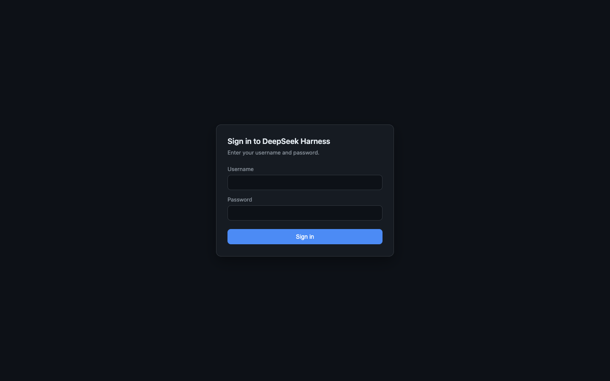
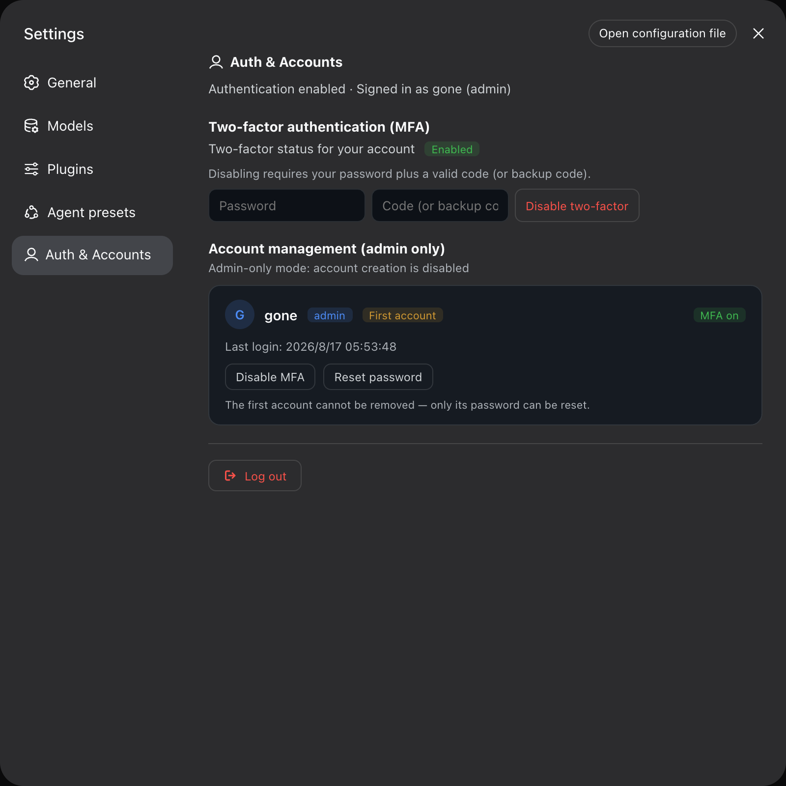

# dsh-remote

[](https://www.npmjs.com/package/@xgone/dsh-remote)
[](LICENSE)

**[English](README.en.md)** | [中文](README.md)

**Make DeepSeek Harness safely accessible remotely**: an account/password + MFA (two-factor)
gate in front of `dsh web` — an external browser signs in and gets the full feature set, with no
native window ever popping up on the host machine.

### Screenshots

| Login gate (any path, unauthenticated) | Settings → Auth & Accounts |
|:---:|:---:|
|  |  |

## Features

- **Remote access**: once exposed behind a reverse proxy (nginx / ssh tunnel / Tailscale / Frp,
  …), an external browser can sign in and use everything; selecting / creating a workspace is an
  in-browser directory dialog — no host OS dialogs; WebSocket event streams work end to end.
- **Login gate**: unauthenticated access to any path gets the login page; `/api` and WebSocket all
  require a valid session; passwords are scrypt-hashed, failed logins are rate limited, and the
  first admin can only be created from the local machine.
- **MFA two-factor (TOTP)**: works with standard authenticators (Google Authenticator /
  1Password / Authy), scan-to-bind + 10 one-time backup codes; an admin can disable MFA for any
  account if the phone is lost.
- **Remote file panel**: clicking a file path opens it in a right-side panel instead of a host
  desktop app, rendered by type — code with syntax highlighting and copy, Markdown rendered,
  image / PDF / video / audio inline, text and directory browsing, Word (.docx) as extracted
  text; un-previewable files download directly on click. Only the DSH home directory and the
  working directory are readable by default; admins can allow more directories from the
  settings page.
- **Multi-account (optional)**: admin-only by default; turn off `adminOnly` to enable
  admin / user / guest roles.
- **Follows DSH**: light / dark theme automatically; English and Chinese follow the DSH app
  language.
- **Faster remote access**: responses are gzipped automatically (remote browsers by default) and
  hashed assets play nicely with edge caches.

## Getting started

### 1. Install

```sh
dsh plugin --profile web add @xgone/dsh-remote
```

### 2. Restart `dsh web`

Patches cannot hot-reload — a restart is required:

```sh
dsh web
```

### 3. Create the first admin

Open `http://127.0.0.1:3080` in a local browser: the login page is in bootstrap mode — enter a
username and password (at least 6 characters) to create the first admin, and you are signed in.

> Server without a local browser? See [Headless servers](#headless-servers-no-local-browser).

### 4. Bind MFA (recommended)

Go to **Settings → Auth & Accounts → Two-factor authentication (MFA) → Enable**, scan the QR code
with your authenticator and enter the 6-digit code. **Save the 10 backup codes first.**

### 5. Remote access

`dsh web` only listens on loopback — expose it through a reverse proxy (WebSocket forwarding
required):

```nginx
server {
  listen 8443 ssl;
  server_name dsh.example.com;
  ssl_certificate     /etc/letsencrypt/live/dsh.example.com/fullchain.pem;
  ssl_certificate_key /etc/letsencrypt/live/dsh.example.com/privkey.pem;
  location / {
    proxy_pass http://127.0.0.1:3080;
    proxy_http_version 1.1;
    proxy_set_header Upgrade $http_upgrade;
    proxy_set_header Connection "upgrade";
    proxy_set_header Host $host;
    proxy_set_header Origin $http_origin;
  }
}
```

`ssh -R` tunnels, Tailscale, Frp, etc. work the same way. For HTTPS deployments also set
`session.secure` to `true` in the config.

## Configuration

Edit the `config` of the `remote` row in `~/.dsh/profiles/web/cordis.patch.yml`. Common options:

```yaml
- id: remote
  config:
    enabled: true          # false = disable the gate (escape hatch if locked out)
    session:
      secure: false        # set true for HTTPS deployments
    adminOnly: true        # false = enable multi-role (admin/user/guest) account management
    bootstrap:             # optional: provision the first admin (only while the store is empty)
      username: admin
      password: 'pick-a-strong-password'
```

Defaults work out of the box; the full option set (session, MFA, rate limit, gzip, file panel,
…) is documented in [docs/REFERENCE.md](docs/REFERENCE.md#13-full-configuration-reference).

### Headless servers (no local browser)

Add the `bootstrap` config block (above) to `cordis.patch.yml` and restart — the first admin is
provisioned at startup, equivalent to the local bootstrap. After the first login, remove the
plaintext password and bind MFA.

## FAQ

| Symptom | Fix |
|---|---|
| No login page after install | Restart `dsh web`; confirm `@xgone/dsh-remote` is in the bundles list |
| 403 when creating the admin | The first admin is loopback-only: use a local browser, or reach `127.0.0.1` via `ssh -L`; on headless servers use the `bootstrap` config |
| Locked out | Set `enabled: false` in `cordis.patch.yml` and restart; or delete `$DSH_HOME/auth/store.json` to re-enter bootstrap mode |
| Lost MFA / phone | As admin: Settings → Auth & Accounts → that account → Disable MFA |
| File panel reports `outside-roots` | Settings → Auth & Accounts → Allowed directories: add the directory (applies immediately, no restart) |
| After a dsh upgrade every `/api` call returns 401 despite a successful login | Upgrade this plugin (≥ 0.3.1) and **sign in once more** — see the [CHANGELOG](CHANGELOG.md) |
| After a dsh upgrade clicking a file path does nothing / never opens the sidebar | Upgrade this plugin (≥ 0.3.2) and restart `dsh web` — see the [CHANGELOG](CHANGELOG.md) |
| Settings pages misbehave / popups return after a dsh upgrade | Upgrade this plugin first — compatibility fixes for new DSH versions ship built-in, see the [CHANGELOG](CHANGELOG.md) |

## Documentation

- **Changelog**: [CHANGELOG.md](CHANGELOG.md) — changes per version, including "after a dsh
  upgrade" compatibility fixes;
- **Technical reference**: [docs/REFERENCE.md](docs/REFERENCE.md) — architecture, internals,
  full configuration and endpoint reference (for AI agents and contributors);
- **Cloudflare Tunnel deployment**: [docs/CLOUDFLARE-TUNNEL.md](docs/CLOUDFLARE-TUNNEL.md)
  (in Chinese) — tunnel-based access with no public IP or open ports, including a paste-ready
  deployment brief for AI agents.

## Uninstall

```sh
dsh plugin --profile web remove @xgone/dsh-remote
```

After restarting `dsh web` the gate is gone; account data is kept in
`$DSH_HOME/auth/store.json` (delete the file for a complete reset).

## Known limitations

- Config changes require restarting `dsh web` (HMR is disabled on the web surface);
- All accounts share the same workspaces and sessions — the DSH core is single-tenant and a
  plugin cannot isolate data; use one profile instance per person
  (`dsh --profile alice --port 3081`) when isolation matters.
