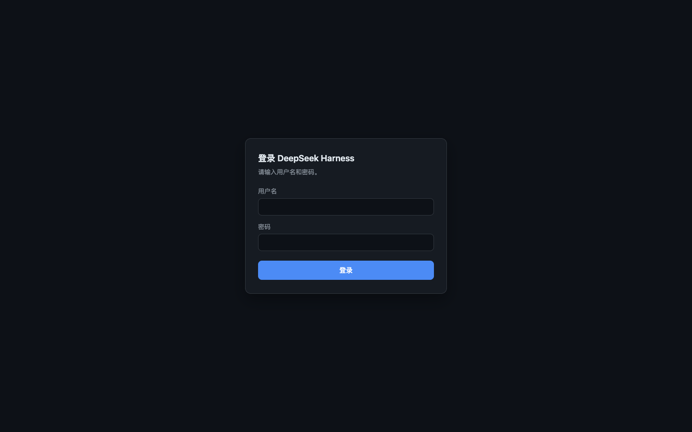
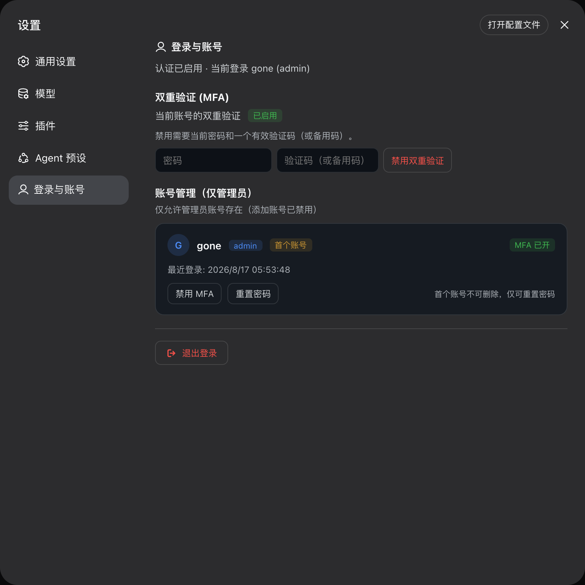

# dsh-remote

[](https://www.npmjs.com/package/@xgone/dsh-remote)
[](LICENSE)

[English](README.en.md) | **中文**

**让 DeepSeek Harness 可以被安全地远程访问**：在 `dsh web` 前增加完整的账号密码认证 + MFA
（两步验证）门禁，并打通外网部署所需的全部环节——外部浏览器登录后即可使用完整功能（含工作区
选择、添加工作区等），全程不会在宿主机上弹出任何原生窗口。

### 界面预览

| 登录门禁（未登录访问任何路径） | 设置 → 登录与账号 |
|:---:|:---:|
|  |  |

---

## 一、已实现的功能（用户视角）

### 1. 远程访问 dsh

- **外网/局域网可用**：经反向代理（nginx / ssh 隧道 / Tailscale / Frp 等）暴露后，外部浏览器
  登录即可使用全部功能。DSH 自带的 `/api` 信任围栏把 `host.pickDirectory`、`settings.*`、
  `credentials.*` 等特权方法硬编码钉死在 loopback（官方注明"直到真正的认证层出现"）——本插件
  就是那个认证层，认证通过后自动放行。
- **工作区/添加工作区不弹宿主窗口**：DSH 默认的目录选择器在 loopback 部署下会调用宿主机原生
  OS 选择框（远程用户看不到）。本插件把选择器替换为 **browse 后端**——选择/新建工作区变成
  **浏览器内的目录对话框**（双栏目录视图 + 面包屑 + 新建文件夹）。
- **WebSocket 全通**：事件下行流（`events.mux` / `events.host`）经认证后正常建立。

### 2. 账号密码验证

- **完整登录门禁**：未登录访问任何路径都得到自包含的登录页；`/api` 与 WebSocket 全部要求有效
  会话 Cookie。
- **安全的会话**：HMAC-SHA256 签名的 HttpOnly Cookie（可配过期时间、Secure、SameSite）；
  签名密钥随机生成并持久化（重启后会话仍有效）。
- **密码安全存储**：scrypt 哈希（`N=16384,r=8,p=1`）+ 常量时间比较，绝不落盘明文。
- **防暴力破解**：登录失败按「IP + 用户名」限速（默认 15 分钟窗口内 5 次）。
- **首次引导**：无账号时登录页提供"创建首个管理员"，仅本机（loopback）可提交，防止远程抢先注册。
- **首个账号受保护**：根账号不可删除、不可改角色，只能重置密码（防止误删唯一管理员锁死）。
- **仅管理员模式（默认）**：运行时禁止新建账号、所有账号强制 admin 角色、设置页隐藏"添加账号"。
- **多角色可选**：关闭 `adminOnly` 后可启用 `admin` / `user` / `guest` 三层方法级权限。

### 3. MFA 两步验证（TOTP）

- **兼容标准认证器**：Google Authenticator、1Password、Authy 等（RFC 6238，6 位 / 30 秒）。
- **扫码绑定**：开启时展示二维码（SVG，实测可扫）+ 手动密钥 + otpauth 链接 + 10 个一次性备用码
  （备用码仅存 SHA-256 哈希）。
- **登录实时验证**：登录页与重登浮层显示"有效剩余 N 秒"倒计时，输入满 6 位数字**自动验证**
  （备用码含字母，仍手动确认）。
- **管理员恢复**：管理员可用自己的密码为任意账号禁用 MFA（找回路径）。

### 4. 体验细节

- 登录页即完整认证面：密码 → 动态码 / 就地绑定引导（含二维码）；
- 会话过期时 SPA 内出现全屏重登浮层，输入自动验证；
- 设置 → 登录与账号：MFA 自服务（开启/关闭）、账号列表（卡片式）、重置密码、退出登录按钮。

### 5. 多语言支持（`zh` / `en`）

插件的全部界面——登录页、MFA 绑定引导、重登浮层、设置页（登录与账号）——均提供中英双语，跟随 **DSH 应用语言设置**（Settings → General → Language）：

- **登录页**：服务端渲染，优先读 `$DSH_HOME/settings.yaml` 的 `locale.preference`（即 DSH 应用语言），未设置时回落浏览器 `Accept-Language`；
- **应用内界面**：接入官方 `@deepseek-ai/dsh-client-locale` 服务（`ctx.locale`），注册插件的 zh/en 字典并实时跟随语言切换——切换语言时设置页与浮层即时更新，无需刷新。

**远程浏览器语言持久化**：DSH 出于安全设计把整个设置面钉死在 loopback（本机）——远程浏览器的设置读写只进内存，语言偏好在 DSH 原生机制下刷新即丢。本插件作为远程部署的认证层，为非 loopback 浏览器接管了语言配置的双向通道：

- **读**：启动时经标准 `settings.describe` RPC 取回持久化偏好并应用到界面（登录页也在服务端读同一份偏好）；
- **写**：语言切换经标准 `settings.mutate` RPC 落盘 `settings.yaml`，跨浏览器、跨设备一致。

本机（`127.0.0.1` / `localhost`）访问完全走 DSH 原生 host-backed 路径，插件不做任何介入。两条通道都基于 DSH UI 自身使用的标准 RPC 信封，不魔改任何宿主内部状态。

---

## 二、安装引导（Installation）

### 0. 前置条件

- 已安装 DeepSeek Harness 并可运行 `dsh web`（默认端口 3080）；
- 已初始化 `web` profile（首次运行 `dsh web` 会自动初始化）；
- 系统 PATH 中有 `pnpm`（`dsh plugin` 命令需要它来管理 profile 的插件）。

### 1. 安装插件包

**NPM 安装（推荐）**——插件已发布到 npm registry，一行命令即可：

```sh
dsh plugin --profile web add @xgone/dsh-remote
```

> - 包主页：https://www.npmjs.com/package/@xgone/dsh-remote
> - 固定版本：`dsh plugin --profile web add @xgone/dsh-remote@0.1.0`

其他安装方式：

```sh
# 从公开 Git 仓库安装
dsh plugin --profile web add git@github.com:xgone/dsh-remote.git

# 本地源码目录（开发/自用，路径替换为你实际的源码位置）
dsh plugin --profile web add ~/path/to/dsh-remote
```

`dsh plugin` 会做三件事：

1. 在 `~/.dsh/profiles/web/` 下用 pnpm 安装该包（输出 `+ @xgone/dsh-remote` 即成功）；
2. 自动把 `@xgone/dsh-remote` 追加到 profile 的 `dsh.profile.bundles`（因为包声明了
   `dsh.bundle.patch`）——无需手动改配置；
3. 插件随下次启动的 composition 生效。

### 2. 确认安装结果

```sh
# bundles 列表中应出现 @xgone/dsh-remote
python3 -c "import json; print(json.load(open('$HOME/.dsh/profiles/web/package.json'))['dsh']['profile']['bundles'])"
# 期望输出类似：['@deepseek-ai/dsh-base', '@deepseek-ai/dsh-web-app', '@xgone/dsh-remote']
```

### 3. 重启 `dsh web`

Web 表面目前禁用 HMR，补丁热重载不可用，**必须重启**才生效：

```sh
# 结束当前 dsh web 进程后重新启动（或直接重启你的启动方式）
dsh web
```

### 4. 首次启动：创建管理员

重启后，浏览器打开 `http://127.0.0.1:3080`：

1. 未登录访问会看到**登录页**（自包含页面，非 SPA）；
2. 由于还没有任何账号，登录页处于**引导模式**：标题为"创建首个管理员账号"；
3. 输入用户名和密码（至少 6 位），点击创建——**仅限本机（loopback）提交**，防止远程抢先注册；
4. 创建成功即登录（签发会话 Cookie），随后可正常使用。

> 验证：`curl http://127.0.0.1:3080/auth/me` 应返回
> `{"authEnabled":true,"bootstrap":false,"authenticated":true,...}`。

### 5. 绑定 MFA（推荐）

登录后进入 **设置 → 登录与账号 → 双重验证 (MFA) → 启用双重验证**：

1. 页面展示**二维码**（Google Authenticator / 1Password / Authy 扫码即可添加）；
2. 同时展示手动密钥、otpauth 链接与 **10 个一次性备用码**——请先保存备用码；
3. 在认证器中输入当前 6 位动态码 → 自动验证并启用；
4. 之后每次登录都需 密码 + 动态码（或备用码）。

> 也可以不进入设置页：登录页在密码验证通过后（未开启 MFA 时）会直接给出"绑定双重验证"引导。

### 6. 验证安装

- 未登录时访问任意路径 → 登录页；直接调用 `/api` → 403；
- 登录后 `/api`、WebSocket 事件流、工作区选择（浏览器内目录对话框）均正常；
- 会话过期（或退出登录）后回到登录页。

### 7. 卸载

```sh
dsh plugin --profile web remove @xgone/dsh-remote
```

`dsh plugin` 会执行 pnpm remove，并自动把该包从 `dsh.profile.bundles` 移除；
重启 `dsh web` 后门禁即消失。已创建的 `$DSH_HOME/auth/store.json` 与账号数据会保留
（如需彻底清除可手动删除该文件）。

### 8. 常见问题

| 现象 | 处理 |
|---|---|
| 安装后无登录页 | 未重启：执行 `dsh web` 重启；或 bundles 列表里没有 `@xgone/dsh-remote`（重跑 `dsh plugin --profile web add ...`） |
| 登录页提交无反应 | 确认表单已填用户名/密码；浏览器控制台的 `content-script.js` 报错是扩展噪音，可忽略 |
| 创建管理员时报 403 | bootstrap 仅限 loopback：请在本机浏览器操作，或经 `ssh -L` 后访问 `127.0.0.1`；无本地浏览器的服务器请用下方 `bootstrap` 配置预置管理员 |
| 被锁在门外（配置出错） | 编辑 `cordis.patch.yml` 设 `enabled: false` 重启；或删除 `$DSH_HOME/auth/store.json` 重新引导 |
| 忘记 MFA / 丢手机 | 管理员登录后在 设置 → 登录与账号 → 该账号行 → 禁用 MFA（需管理员密码） |
| 远程访问时「设置 → 插件」配置页空白 | v0.1.5+ 已内置修复：DSH 对远程浏览器把所有设置 scope 切成 memory 模式（读写在客户端被丢弃），插件启动时自动解除该限制并触发一次全量刷新，配置卡片远程可读可写；原始 settings.yaml 文档编辑器仍保持仅限本机（设计如此） |
| 远程刷新后反复弹出「内测声明」 | v0.1.6+ 已内置修复（已确认用户）：DSH 的欢迎弹窗确认态 `WelcomeNoticeStore` 对远程走 memory 模式，不读已持久化的确认；插件用官方 `settings.describe` RPC 读 `ui-onboarding.welcomeNoticeVersion`，有值时经官方 `store.update` 置 `acknowledged=true`，`WelcomeNotice` 即自动收场不再弹。全程只用官方 slots/store/RPC，不重写 DSH 内部方法、不改 persistence。纯远程首次用户（从无确认）维持原行为 |
| 远程打开「设置 → 模型」提示"加载提供方目录失败: settings are unavailable in this browser" | v0.2.6+ 已内置修复：DSH 升级后所有设置读取改经共享的 `SettingsDescribeMirror`（远程构造为 memory 模式，`view` 恒为 undefined），Models 页因此抛错；插件用官方 `settings.describe` RPC 读取设置文档，经官方 `ctx.settingsScope.describe()` 拿到 mirror，再用官方 `store.set` 注入 `view`，Models 目录远程正常加载。全程只用官方 RPC/服务/store API，不重写 DSH 方法、不改 persistence |

### 9. 无浏览器服务器（headless / Linux）安装

服务器没有本地浏览器时，UI 的「创建管理员」引导（仅限 loopback）无法使用。用 `bootstrap`
配置节在启动时直接预置首个管理员（等价于 loopback 引导：同样受保护、管理员角色、scrypt 哈希）：

```sh
dsh plugin --profile web add @xgone/dsh-remote
# 编辑 ~/.dsh/profiles/web/cordis.patch.yml，给 remote 行加 config:
```

```yaml
- id: remote
  config:
    enabled: true
    bootstrap:
      username: admin          # 首次启动时创建（仅当账号库为空）
      password: '换成一个强密码'
```

要点：

- **幂等**：账号库非空后该配置被忽略（日志提示移除凭据），不会重复创建、不会覆盖已有密码；
- 密码至少 6 位（与 UI 引导一致），违规会在启动时报错并中止；
- 首账号与 UI 引导一致：`protected: true`（不可删除/降级，仅可重置密码）；
- 建议首次登录后从 `cordis.patch.yml` 移除该配置节（保留也无风险——账号存在后即失效），
  之后可在 设置 → 登录与账号 绑定 MFA；
- 反向代理部署只需再加 `trustProxy: true`（默认已开启）。

## 三、配置（`cordis.patch.yml`）

```yaml
# ~/.dsh/profiles/web/cordis.patch.yml（覆盖 remote 行的整份 config，缺省键回落到默认值）
- id: remote
  config:
    enabled: true
    accounts: []            # 种子账号（明文密码启动时转 scrypt 哈希；或直接给 scrypt$<salt>$<hash>）
    secret: ''              # 空 = 自动生成并持久化
    session:
      cookieName: dsh_session
      ttlSeconds: 604800    # 7 天
      secure: false         # HTTPS 部署建议 true
      sameSite: lax
    enforceRoles: true      # admin/user/guest 方法级权限
    adminOnly: true         # 仅管理员账号（默认）
    trustProxy: true        # 已认证请求归一化 Host/Origin，放行外部访问（默认）
    bootstrap:
      username: admin       # 可选：无浏览器服务器预置首个管理员（账号库为空时生效）
      password: '...'
    mfa:
      enabled: true
      issuer: DeepSeek Harness
      window: 1             # ±1 个 30 秒步长
      backupCodes: 10
    rateLimit:
      maxAttempts: 5
      windowMs: 900000
    gzip:
      enabled: true          # 响应 gzip 压缩总开关（默认开）
      remoteOnly: true       # 仅对远程（非 loopback Host）请求压缩；false 则本地也压
      minBytes: 1024         # 已知 Content-Length 小于此字节数的响应不压缩
    files:
      enabled: true          # 远程文件显示（/auth/file）总开关（默认开）
      roots: []              # 额外允许读取的根目录（绝对路径）
      maxListing: 500        # 目录索引每页最多渲染的条目数
```

> **Windows 提示**：默认根目录是 DSH 主目录与 dsh 进程工作目录（通常是 profile 目录），工作区文件常在
> 其他盘符路径下。被拒绝时面板会直接显示当前允许的根目录列表；把工作区所在目录加入 `files.roots`
> 即可，YAML 中路径写双反斜杠或正斜杠：
>
> ```yaml
> remote:
>   files:
>     roots:
>       - "E:\\CODE"
>       - "D:/projects"
> ```

关闭认证：`enabled: false`。

**远程文件显示**：DSH 的 Web UI 点击文件路径时走 `host.openPath` RPC，把路径交给**宿主机**桌面
的默认应用打开——远程浏览器用户完全看不到。本插件在远程（非 loopback）浏览器上拦截该 RPC，改为在
**右侧边栏面板**中显示（`/auth/file` 由宿主机流式返回，参考 Claude Desktop 的交互）：
- Markdown 使用界面同款渲染器排版，图片 / PDF / 视频内联显示，文本与代码等宽预览，目录可逐级点击浏览
- 支持同时打开**多个面板**，自动上下等分分割；每个面板右上角有独立的「放大」（占满整个侧栏，可还原）
  与「关闭」按钮
- 面板头部显示文件名与完整路径；侧栏左缘可拖拽调整宽度；Esc 关闭最上方 / 放大的面板
- 不可预览的二进制提供下载与新标签页兜底

DSH 原生的右侧 details 列（会话详情，单槽位）不受影响，本侧栏以覆盖层形式与其并存。读取范围被限制在
DSH 主目录、进程工作目录与 `files.roots` 列出的额外根目录内（realpath 校验，符号链接逃逸与
`..` 穿越都会被拒绝）；本机（loopback）访问保持 DSH 原生行为不变。`files.enabled: false` 可完全
关闭。

**响应 gzip 压缩**：插件会为**认证后**的可压缩响应（HTML / CSS / JS / JSON / SVG / manifest 等）自动
gzip 压缩，显著减小远程访问时大历史会话与大型 bundle 的传输体积；并给带 rev 的哈希静态资源
加 `Cache-Control: immutable` 与 `CDN-Cache-Control` 以配合 Cloudflare 等边缘缓存。默认**仅对
远程（非 loopback）浏览器压缩**（`gzip.remoteOnly: true`），本机直连不压缩省 CPU；需要本地也
压缩可设 `false`。SSE 事件流、二进制类型（`image/*` 等）、已压缩响应（带 `Content-Encoding`）、
`204/206/304` 与过小的响应（`Content-Length < minBytes`）不会被压缩。`gzip.enabled: false` 可
完全关闭。

---

## 四、代码层面的实现

### 架构总览

插件是 **Cordis 双半区包 + bundle 补丁**：

```
dsh-remote/
├── cordis.patch.yml   # bundle 补丁：插入 remote 行；替换目录选择器后端
├── lib/
│   ├── index.js       # 宿主半区：门禁、会话、限速、角色、trustProxy、/auth/* 路由
│   ├── store.js       # 账号存储（scrypt 哈希、受保护标记、TOTP 状态、备用码哈希）
│   ├── totp.js        # RFC 6238 TOTP / base32 / otpauth URI / 备用码（零依赖）
│   ├── login-page.js  # 自包含登录页（密码 → 动态码 → 绑定引导，含二维码）
│   └── client.js      # 浏览器半区：重登浮层、设置页「登录与账号」、退出按钮
└── package.json       # dsh.bundle.patch + dsh.client 声明 + ./client 导出
```

- 安装后 `dsh plugin` 自动把 `@xgone/dsh-remote` 追加进 `dsh.profile.bundles`，补丁随 composition 应用；
- 宿主半区以 `inject: ["webServer"]` 激活，浏览器半区由客户端模块系统扫描进
  `window.__DSH_BOOT__` 并挂到 `settings.section` / 覆盖层。

### 1. 门禁（`lib/index.js`）

DSH 的 `webServer` 路由模型是"精确表 → 前缀表 → fallback"，**没有中间件钩子**。插件通过
**包装路由注册方法 + 就地包装已注册表项**实现全量门禁：

- 包装 `register` / `registerUpgrade` / `registerFallback` 三个方法，并对
  `webServer.exact / prefixes / upgrades` 表与 `fallback` 中**已注册**的每一项逐个包装（用
  `Symbol` 标记避免重复包装，`WeakMap` 记录原始处理器以便卸载还原）；
- 包装后的 HTTP 处理器：`/auth/*` 放行 → 无有效会话则页面请求返回登录页、其余 403 →
  通过后**先归一化 Host/Origin 再交给下层**（见 `trustProxy`）；
- WebSocket 升级握手：无 Cookie 直接销毁 socket；
- 角色门禁：非 admin 会话先读取 RPC 信封（上限 16 MiB）按 `method` 查禁止表，命中 403，
  放行时用可重放请求体（`Readable` + `Proxy`）交给下层，admin 零开销。

### 2. 会话与口令

- **会话 Cookie**：`v1.<base64url payload>.<HMAC-SHA256 sig>`，payload 含
  `{sub, role, iat, exp}`；验证时重算签名并常量时间比较，且账号必须仍存在（删除即失效）；
- **MFA 挑战令牌**：`mfa.<payload>.<sig>`，5 分钟有效、一次性（nonce 消费集合防重放）；
- **口令**：scrypt（node:crypto），登录时异步验证 + 常量时间比较；
- **限速**：内存表按「IP:username」计数，密码步骤与 MFA 步骤使用不同键（MFA 失败计数不会被
  成功密码步骤清掉）。

### 3. 外网放行（`trustProxy`）

DSH 内置的浏览器信任围栏（`dsh-client-connection`）校验 `Host`（loopback 或 `trustedHosts`）、
`Origin` 与 Host 一致、`sec-fetch-site` 非 cross-site，且**特权方法**（`host.pickDirectory`、
`settings.*`、`credentials.*` 等）被硬编码钉在 loopback。插件在认证通过后把请求的
`Host`/`Origin` 归一化为 `127.0.0.1:<端口>`（保留原 scheme）再交给下层——围栏判定为 loopback，
特权方法对外部浏览器放行。未认证请求仍被门禁 403，围栏的 DNS-rebinding 语义在 Cookie 之后不再
需要。

### 4. 存储（`lib/store.js`）

`$DSH_HOME/auth/store.json`（0600，原子写入）：

```jsonc
{
  "version": 1,
  "secret": "<base64url 32B>",          // 会话/MFA 令牌签名密钥
  "accounts": [{
    "username": "admin",
    "role": "admin",
    "passwordHash": "scrypt$<salt>$<hash>",
    "protected": true,                  // 首个账号：不可删/不可改角色
    "totp": { "secret": "<base32>", "verified": true, "createdAt": 0 },  // 未启用则为空
    "backupCodes": [{ "hash": "<sha256>", "usedAt": 0 }],                // 备用码仅存哈希
    "createdAt": 0, "updatedAt": 0, "lastLoginAt": 0
  }]
}
```

迁移逻辑：老存储无 `protected` 字段时，按 `createdAt` 最早的账号自动标记为受保护并落盘。

### 5. TOTP（`lib/totp.js`，零依赖）

- base32 编解码（RFC 4648）、`otpauth://` URI 构造；
- TOTP = HMAC-SHA1(secret, 8 字节大端计数器) 动态截断取 6 位，30 秒周期；验证支持 ±window
  步长；已用 RFC 6238 SHA-1 附录测试向量（T=0..5）验证；
- 备用码：10 个 8 位无歧义字符码，仅存 SHA-256 哈希，每个可用一次。

### 6. 登录页（`lib/login-page.js`）

由被包装的 fallback 在未认证时直接内联输出，**零外部资源**。阶段机：
`password → (code | offer) → setup`：

- 密码步骤 → 有 MFA 则进入动态码步骤（含"有效剩余 N 秒"倒计时、6 位自动提交）；
- 无 MFA 则展示"绑定双重验证"引导（可跳过）；
- 绑定步骤展示二维码（`/auth/mfa/setup` 返回的 SVG data URL）+ 密钥 + otpauth + 备用码 +
  验证输入，验证成功跳转 `next`；
- 表单 `novalidate` + JS 手动校验（避免隐藏必填控件阻塞提交）。

### 7. 浏览器半区（`lib/client.js`）

手写 `window.__ModuleLoader__.load({id, factory})` 格式（与官方包一致，无需打包），通过
`require("react")` / `react-dom/client` 挂载：

- **重登浮层**：`/auth/me` 轮询（15s + focus），未认证且启用认证时全屏覆盖登录（支持 MFA 第二步）；
- **设置 → 登录与账号**（`settings.section` slot，带用户图标，用 CSS 隐藏 shell 默认齿轮）：
  状态、MFA 自服务、账号卡片列表（重置密码/禁用 MFA/删除）、退出登录；
- 所有数据走 `fetch("/auth/*")`（同源 Cookie），不依赖 settings 域（第三方程无法注册）。

### 8. 目录选择器替换（`cordis.patch.yml`）

补丁行**不能改名**（`name mismatch` 会被跳过），因此用"禁用 + 插入"：

```yaml
- id: directory-picker        # 禁用 auto 选择器（loopback 下会解析成 native、在宿主弹窗）
  disabled: true
- insert:
    - id: directory-picker-browse      # browse 宿主后端（host.listDirectory / createDirectory）
      name: '@deepseek-ai/dsh-host-directory-picker-browse'
      config: { maxEntries: 1000 }
    - id: directory-picker-browse-ui   # 浏览器端目录对话框
      name: '@deepseek-ai/dsh-client-ui-directory-picker-browse'
```

### 9. 安全模型（威胁分析）

| 攻击面 | 防护 |
|---|---|
| 未认证访问 `/api` / 静态页 / WebSocket | 门禁 403 / 登录页 / 握手拒绝 |
| 密码爆破 | scrypt + 限速（IP+用户名） |
| 会话伪造/篡改 | HMAC 签名 + 过期 + 常量时间比较 + 账号存在性校验 |
| 会话重放（MFA 第二步） | 一次性 nonce + 5 分钟 TTL |
| 远程抢先注册管理员 | bootstrap 仅 loopback |
| 误删唯一管理员 | 受保护账号 + 最后管理员保护 |
| 跨站请求（CSRF） | HttpOnly + SameSite=lax；跨站请求带不上 Cookie，门禁即 403 |
| DNS rebinding | 认证层已接管围栏语义；未认证请求不会到达围栏 |

---

## 五、远程部署

`dsh web` 仍拒绝 `--host 0.0.0.0`，请用反向代理暴露（TLS 终结 + WebSocket 转发）：

```nginx
server {
  listen 8443 ssl;
  server_name dsh.example.com;
  ssl_certificate     /etc/letsencrypt/live/dsh.example.com/fullchain.pem;
  ssl_certificate_key /etc/letsencrypt/live/dsh.example.com/privkey.pem;
  location / {
    proxy_pass http://127.0.0.1:3080;
    proxy_http_version 1.1;
    proxy_set_header Upgrade $http_upgrade;      # WebSocket（events.mux/host）
    proxy_set_header Connection "upgrade";
    proxy_set_header Host $host;                 # 保留外部 Host
    proxy_set_header Origin $http_origin;
  }
}
```

同样适用于 `ssh -R` 隧道、Tailscale、Frp 等。HTTPS 部署时把 `session.secure` 设为 `true`。

## 六、多账号体系（设计思考）

- **已实现**：多账号 + 角色（admin/user/guest）、集中管理、MFA、审计字段（创建/更新/最近登录）；
- **做不了**：每用户独立工作区/会话（多租户数据隔离）——DSH 核心是单租户（`$DSH_HOME` 进程级
  共享），事件流、搜索、任务等全局泄漏无法在插件层隔离；
- **推荐**：每人一个 profile 实例（`dsh --profile alice --port 3081`）天然隔离数据；共享实例
  协作则用角色体系。

## 七、端点一览

| 方法 | 路径 | 说明 |
|---|---|---|
| POST | `/auth/login` | 登录；有 MFA 时返回 `{mfaRequired, mfaToken}`（不签 Cookie） |
| POST | `/auth/mfa/login` | 第二步：`{mfaToken, code}`（动态码或备用码） |
| POST | `/auth/logout` | 清除 Cookie |
| GET | `/auth/me` | `{authEnabled, bootstrap, authenticated, username, role, mfa, adminOnly}` |
| POST | `/auth/bootstrap` | 首个管理员引导（仅 loopback、仅空存储） |
| POST | `/auth/mfa/setup` | 生成密钥 + otpauth + 二维码 + 备用码（pending 状态） |
| POST | `/auth/mfa/verify` | 用动态码确认 pending 设置 |
| POST | `/auth/mfa/disable` | 关闭本账号 MFA（需密码 + 有效动态码/备用码） |
| POST | `/auth/accounts` | 管理员：`{action: list\|upsert\|remove\|disable-mfa, ...}` |

## 八、限制与逃生通道

- Web 表面禁用 HMR，改配置后**必须重启 `dsh web`**；
- 逃生：`enabled: false` 重启即恢复；或删除 `$DSH_HOME/auth/store.json` 重新引导；
- 恢复原生目录选择器：见"代码层面实现"第 8 节的补丁片段（反转 disabled）。
